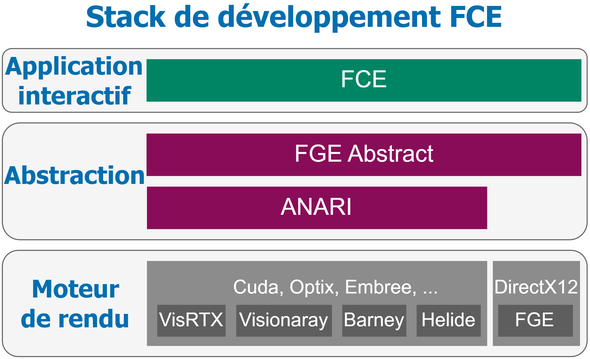
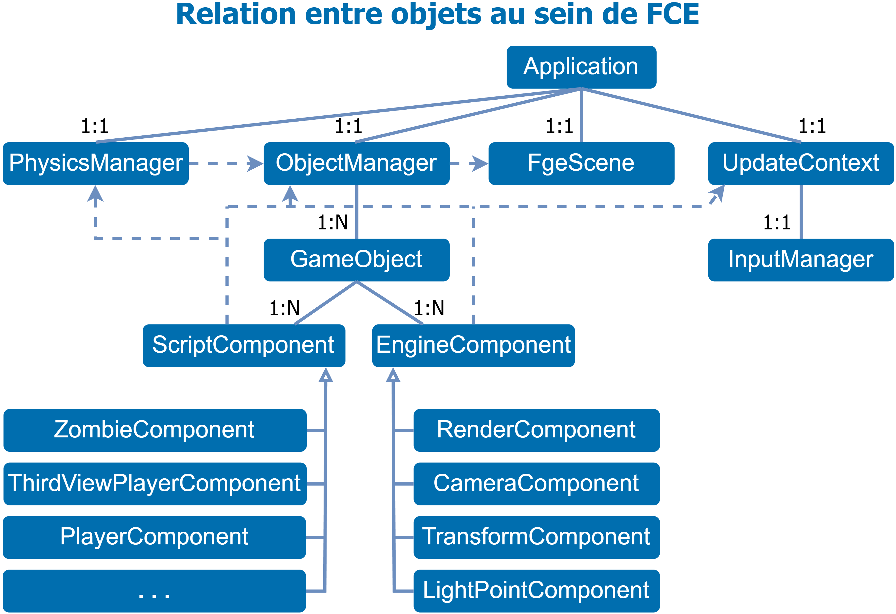
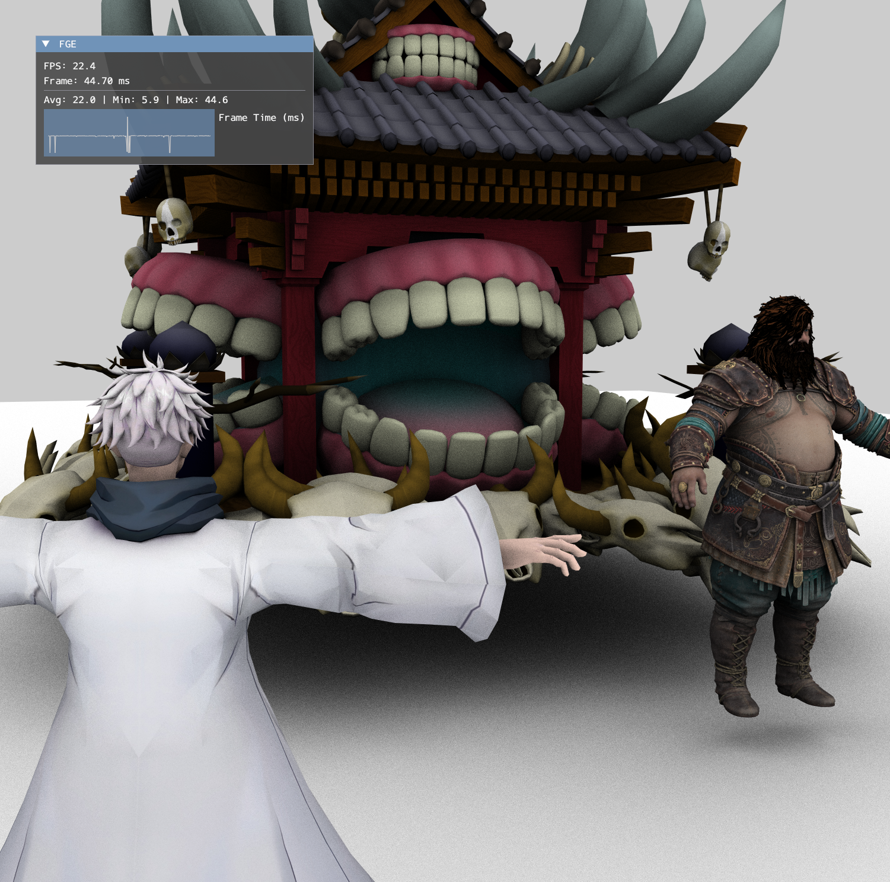
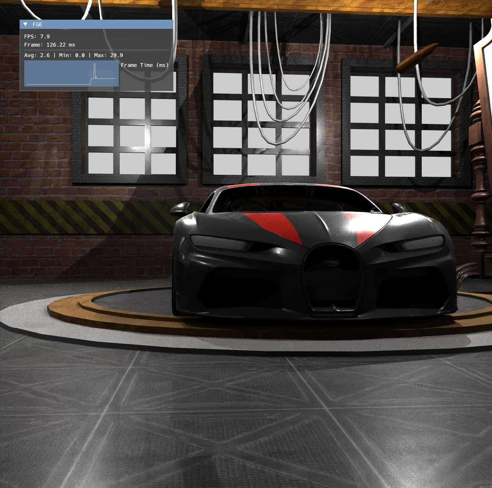
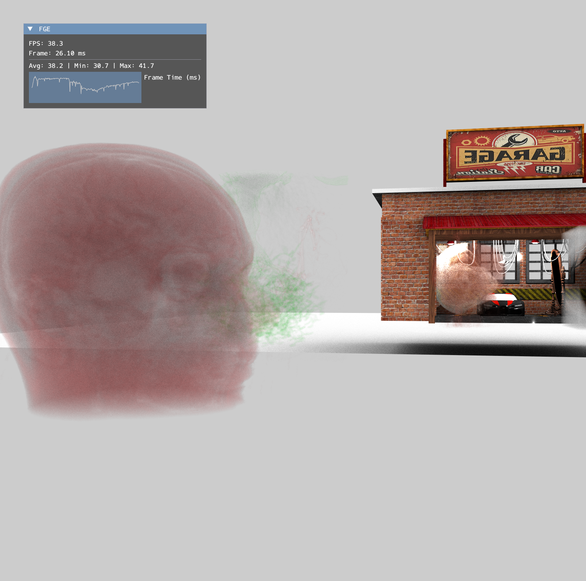
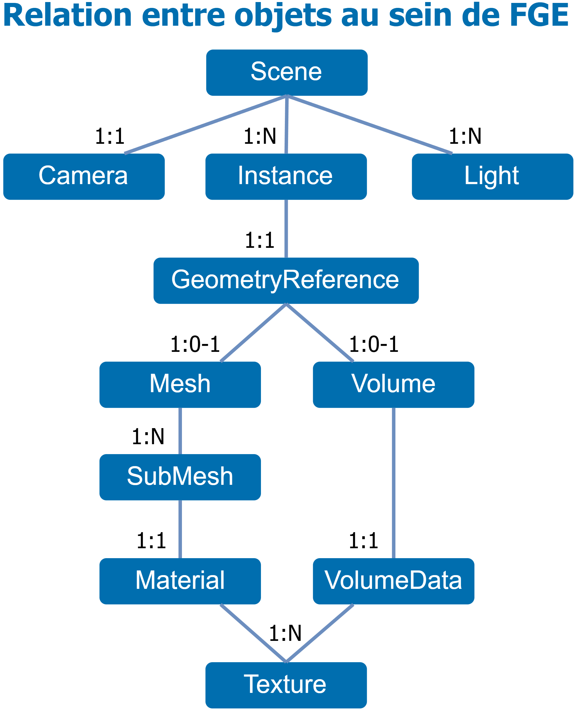
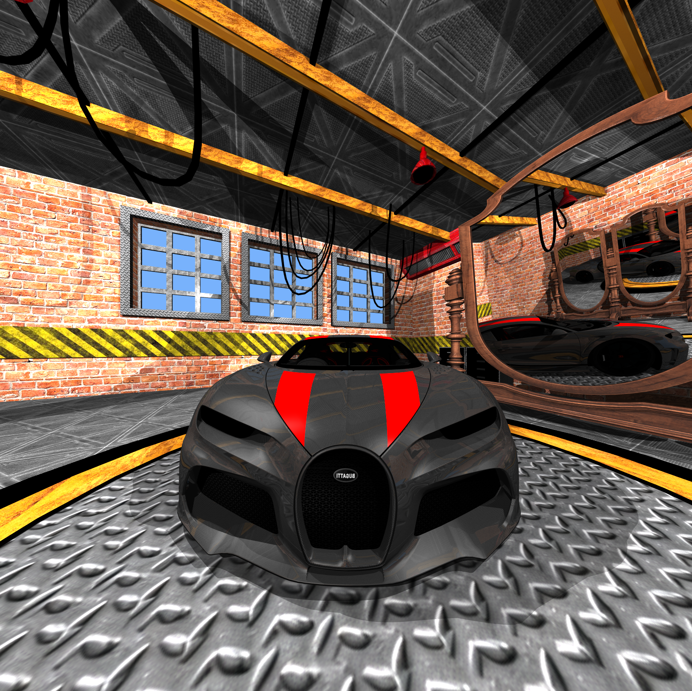
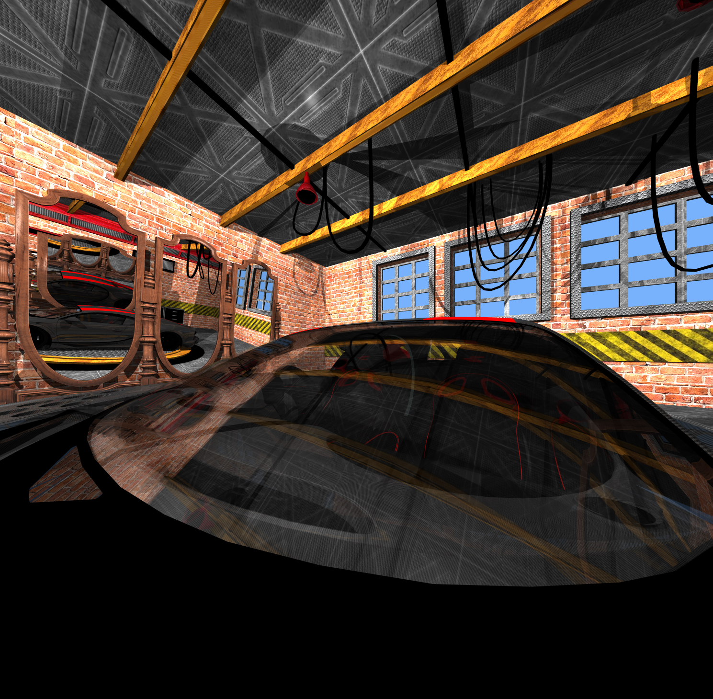
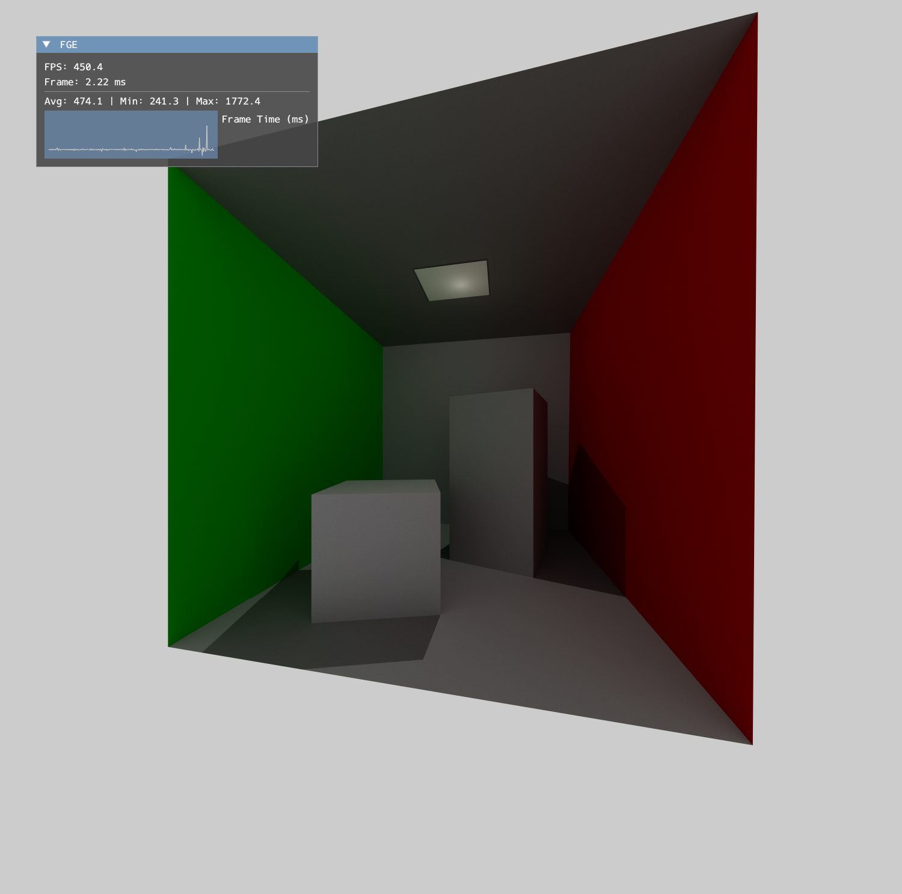
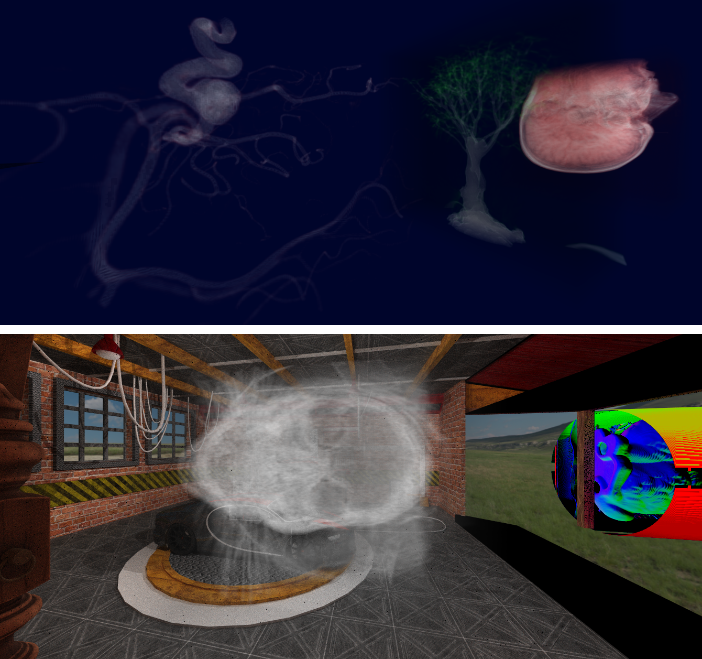

# Project FCE : Real-Time Interactive Ray Tracing Engine (5th year)

Personal Project<br>
2025-2026

FCE (Founzo Creativity Engine) is a real-time interactive engine built on top of FGE, a GPU ray-tracing renderer primarily based on DirectX 12, with optional support for ANARI through an abstraction layer.

## Motivation

The goal of this project is to deeply understand low-level GPU rendering and ray tracing pipelines, while experimenting with abstraction layers for portability.

Key objectives:
- Master DirectX 12 and DXR internals
- Design a modular rendering abstraction (FGE Abstract)
- Compare rendering backends (DirectX12 vs ANARI implementations)

Beyond the technical challenge, this project is also driven by pure interest and fun: creating a real-time ray-traced engine that can be used to:
- test new rendering ideas,
- and serve as a base for future academic and personal projects.

## Project Overview

FCE is organized into three layers:

| Layer | Description |
|-------|-------------|
| FCE | Interactive runtime (application, ECS, input, scripting) |
| FGE Abstract | Rendering abstraction layer |
| Backends | DirectX12 (FGE) or ANARI implementations |

Global stack between FCE / FGE / ANARI:
<figure style="text-align:center;">  </figure>

## Key Concepts

### FCE (Runtime)

- GameObject / Component system
- Script-driven behaviors
- Input & camera management
- Real-time scene updates

### FGE (Renderer)

- DXR ray tracing pipeline
- TLAS / BLAS management
- GPU memory managers
- Materials, textures, lights
- Can be used via a dedicated ANARI implementation

### FGE Abstract

- Unified API for rendering
- Backend switching (DX12 / ANARI)
- Enables renderer benchmarking

## Rendering abstraction

FCE object relationships:
<figure style="text-align:center;">  </figure>

FGE can be used in two ways:
- Native backend: DirectX12 ray tracing engine
- ANARI backend: interoperability layer (fge/fgeia/) exposing FGE as an ANARI implementation
This allows testing multiple renderers transparently.

## Rendering Backends (ANARI)

The abstraction allows testing external ANARI implementations:

ANARI backends tested Visionaray, Barney, VisRTX:
<figure style="text-align:center;"> <table align="center"> <tr> <td></td> <td></td> <td></td> </tr> </table> </figure>

## FGE Rendering Features

FGE scene representation:
<figure style="text-align:center;">  </figure>

### Phong Integrator

FGE currently provides a Phong-based integrator:

<figure style="text-align:center;"> <table align="center"> <tr> <td></td> <td></td> <td></td> </tr> </table> </figure>

### Path Tracer

A minimal path tracer is implemented:
- Per-hitgroup BSDF: Explicit PDF + eval
- SPP accumulation between frames

Path tracing - Cornell Box:
<figure style="text-align:center;">  </figure>

### Volume Rendering (DVR)

FGE supports Direct Volume Rendering (DVR):
- Ray marching
- Transfer function support
- Isosurface representation

Volume rendering with transfer function:
<figure style="text-align:center;">  </figure>

### ANARI Integration

FGE can also be used through a **dedicated ANARI implementation** (`fge/fgeia/`), exposing the engine as an ANARI device.

This allows:
- interoperability with external ANARI-based applications such as Blender
- comparison with other ANARI renderers
- validation of the DirectX 12 backend through the ANARI abstraction layer

## Project Structure

```
FCE/
├── application/          # Entry point & scenes
├── fge/                  # Rendering engine
│   ├── src/              # DirectX12 & ANARI render engine
│   ├── include/          # Public headers
│   │   ├── fge/          # Headers of fge
│   │   └── fgewa/        # Headers for ANARI Backend
│   ├── fgeia/            # ANARI implementation of FGE
│   └── shaders/          # DXR shaders
├── src/                  # FCE runtime (ECS, input, logic)
├── include/              # Public headers
├── modelisation/         # UML / diagrams
├── images/               # README figures
└── CMakeLists.txt
```

## Compilation

### Requirements

- Windows 10/11
- CMake + Ninja
- DirectX 12 + DXR GPU
- DXC (Shader Compiler)
- ANARI SDK (optional backend)
- vcpkg (recommended)

### Clone

To download the sub Git repositories, you can run the following command:

```bash
git clone --recursive https://github.com/Founzo77/FCE---2025-2026-
```

### Build

```bash
mkdir build
cd build
cmake -G "Ninja" -DCMAKE_BUILD_TYPE=Debug -DFGEIA_AUTO_GENERATE_QUERIES=OFF -Danari_DIR=C:/src/anari_debug/lib/cmake/anari-0.15.0 -DCMAKE_TOOLCHAIN_FILE=C:/src/vcpkg/scripts/buildsystems/vcpkg.cmake ..
cmake --build . --parallel
```

Shaders are compiled automatically using `dxc` and copied alongside the executable, together with scenes and assets.

### Execution

Run the main engine:

```bash
main.exe
```
