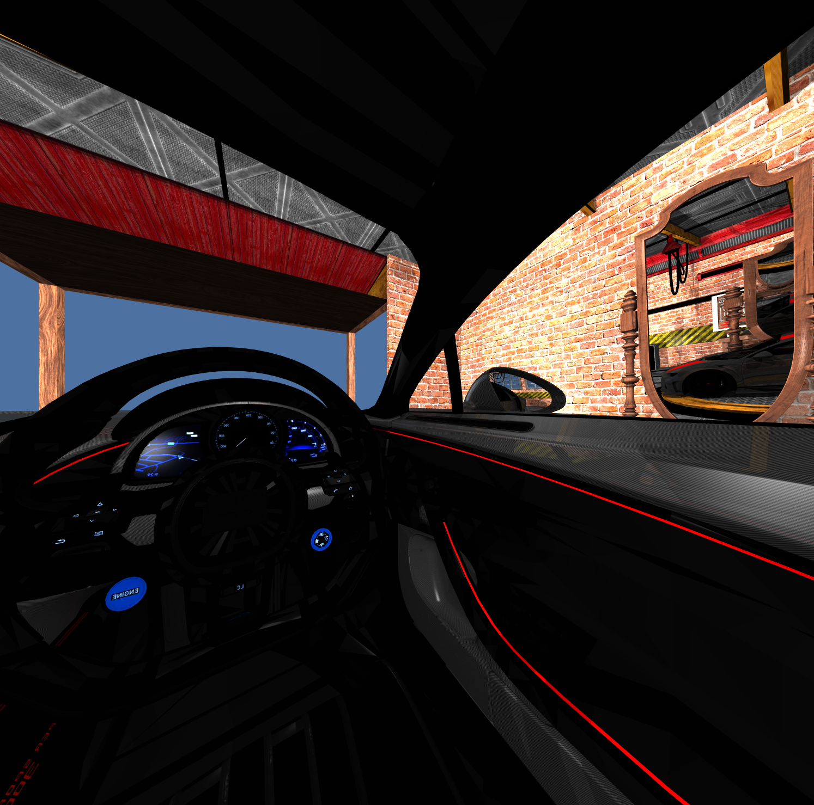
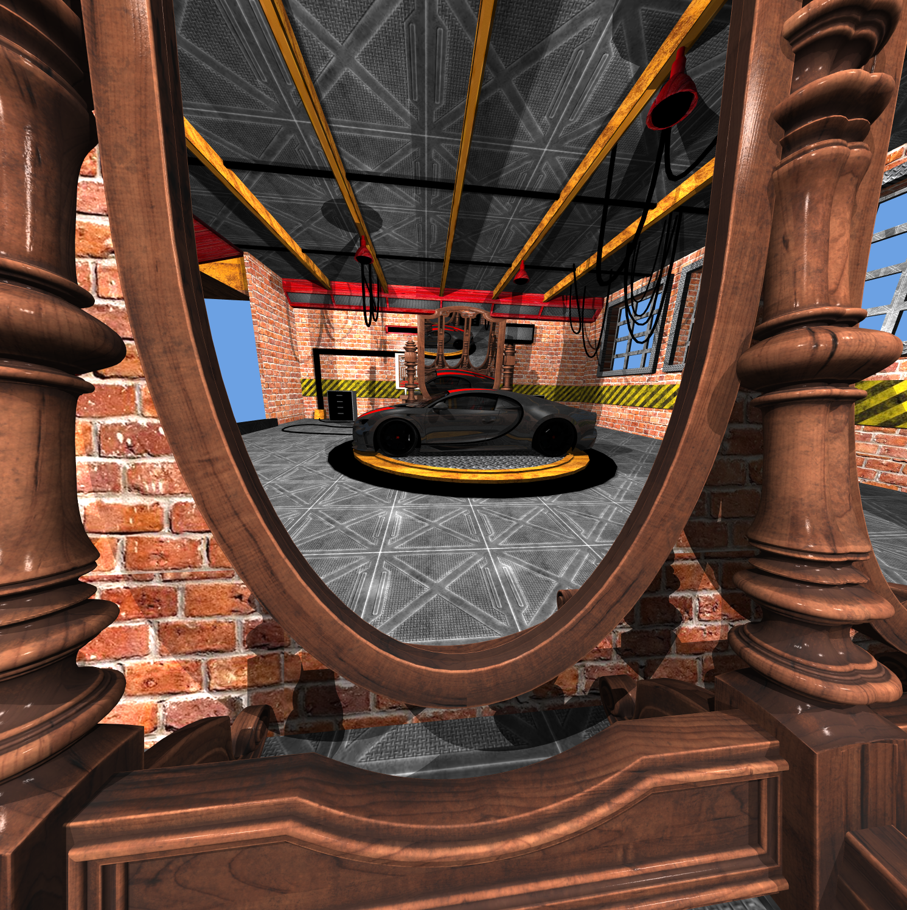
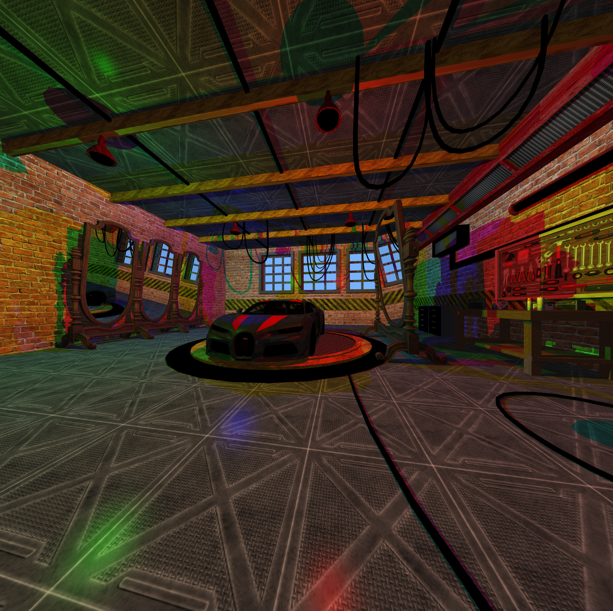
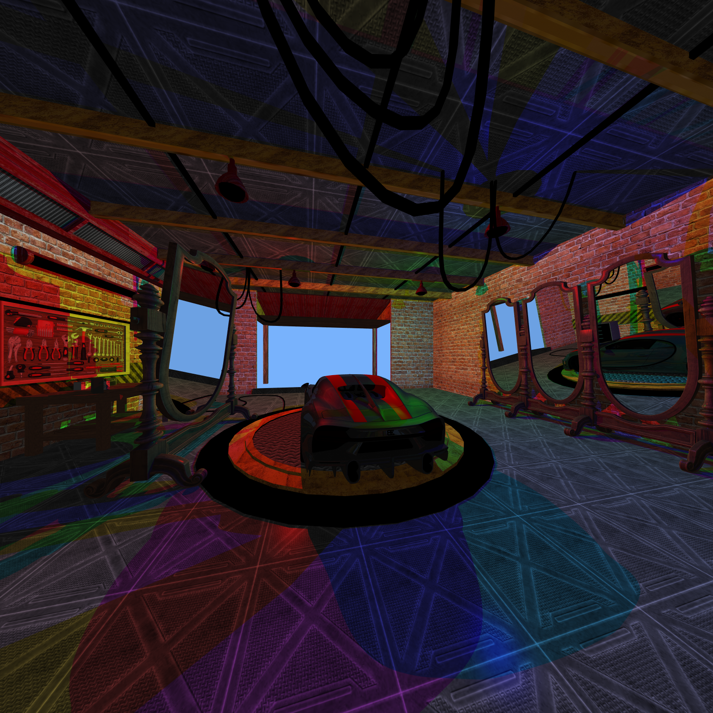

# Project FCE : Real-Time Interactive Ray Tracing Engine (5th year)

Personal Project<br>
2025-2026

FCE (Founzo Control Engine) is a real-time interactive engine built on top of FGE (Founzo Graphics Engine), a DirectX 12 GPU ray-tracing renderer.
FCE adds a full game-style runtime layer on top of FGE, providing input handling, scene logic, scripting, cameras, and object management.

## Motivation

The main goal of this project is to deeply understand modern low-level rendering APIs, with a particular focus on DirectX 12 and GPU ray tracing (DXR).

Building a real-time ray tracing engine from scratch makes it possible to truly understand:
- how data flows from CPU to GPU,
- how ray tracing pipelines are built and dispatched,
- how scene updates affect performance and memory layout.

Beyond the technical challenge, this project is also driven by pure interest and fun:
creating a real-time ray-traced engine that can be used to:
- test new rendering ideas,
- and serve as a base for future academic and personal projects.

FCE is meant to be a long-term engine that grows with new experiments in rendering, simulation, and interaction.

## Project Overview

FCE is composed of two main layers:

| Layer | Role |
|-------|------|
| FGE | Low-level rendering engine based on DirectX 12 DXR (BVH, shaders, GPU memory, ray dispatch) |
| FCE | High-level runtime: windowing, input, game objects, components, scripts, camera & scene interaction |

FGE provides a fully GPU-driven ray tracing renderer supporting:
- triangle meshes
- textures
- materials
- lights
- TLAS / BLAS
- physically-based camera

FCE wraps FGE with:
- a Windows application layer
- an entity / component system
- a scripting system
- XML-based scene loading
- real-time input & camera control

This separation allows FGE to remain a pure rendering engine, while FCE becomes a real-time interactive engine.

Here are some images showing the engine's visual capabilities:

<figure style="text-align:center;">
    <table align="center">
        <tr>
            <td>
                
            </td>
            <td>
                
            </td>
        </tr>
    </table>
</figure>
<figure style="text-align:center;">
    <table align="center">
        <tr>
            <td>
                
            </td>
            <td>
                
            </td>
        </tr>
    </table>
</figure>

<figure style="text-align:center;">
    <table align="center">
        <tr>
            <td>
                
            </td>
            <td>
                
            </td>
        </tr>
    </table>
</figure>

## Key Features

### Rendering (FGE)
- DirectX 12 DXR ray tracing
- Hardware-accelerated:
    - BLAS / TLAS
    - ray generation, miss & hit shaders
- Physically-based camera
- Textured materials
- Multiple lights
- GPU-resident scene memory
- Real-time ray dispatch

### Engine & Runtime (FCE)
- Win32 application & window management
- XML-based scene loading
- Game-object / component system
- Scriptable behaviors (player, camera, zombies, etc.)
- Real-time keyboard & mouse input
- First-person / third-person camera control
- Multiple cameras & camera manager
- Light and object tracking
- Real-time scene updates propagated to the GPU

## Engine Architecture

The engine is organized as a two-layer architecture:

```
+----------------------------+
|           FCE              |
|----------------------------|
| GameObjects                |
| Components                 |
| Scripts                    |
| Input                      |
| Camera control             |
| XML scene loader           |
+-------------▲--------------+
              |
              |
+-------------|--------------+
|             FGE            |
|----------------------------|
| DirectX 12 device          |
| Ray tracing pipeline (DXR) |
| GPU scene memory           |
| TLAS / BLAS                |
| Shaders (DXIL)             |
| Swap chain                 |
+----------------------------+
```

FCE never talks to the GPU directly.
It modifies the FGE Scene interface, which then updates GPU buffers, TLAS, materials, lights and camera.

## Game Object System

FCE implements a hybrid ECS-like architecture:

### GameObject

A GameObject is a container of:
- engine components (transform, render, camera, light)
- script components (player, zombie, camera manager, etc.)

### Engine Components

They represent the renderable & physical state:

| Component | Role |
|-----------|------|
| `TransformComponent` | Position, orientation, scale |
| `RenderComponent` | Mesh & instance link |
| `CameraComponent` |Camera parameters |
| `LightPointComponent` | Point light |

These components are synchronized with the FGE scene.

### Script Components

They implement runtime behavior:

| Script | Function |
|--------|----------|
| `PlayerComponent` | Player movement |
| `ThirdViewPlayerComponent` | Third-person camera |
| `ZombieComponent` | Target tracking AI |
| `CameraManagerComponent` | Camera switching |
| `PlayerManagerComponent` | Multiple players |
| `DebugPositionComponent` | Debug utilities |

Scripts run every frame and modify transforms, cameras and lights, which are then pushed to the GPU via FGE.

## GPU Scene Management (FGE)

FGE manages all GPU data using custom memory managers:
- MeshMemoryManager: BLAS, vertex & index buffers
- InstanceMemoryManager: TLAS
- MaterialMemoryManager:GPU material tables
- TextureMemoryManager: SRV arrays & indirection tables
- LightMemoryManager: structured buffers
- Constant buffers: camera & frame data

Updates from FCE (movement, new objects, lights, etc.) are incrementally uploaded to the GPU, minimizing bandwidth and rebuild cost.

## Shader Pipeline

Shaders are compiled with DXC into DXIL libraries:

| Shader | Role |
|--------|------|
| raygen.hlsl | Primary ray generation |
| miss.hlsl | Background / environment |
| closesthit.hlsl | Material shading |

The ray tracing pipeline uses:
- global & local root signatures
- shader binding table (SBT)
- TLAS and per-mesh BLAS
- bindless textures & materials

## Project Structure

```
FCE/
├── application/
│   ├── main.cpp
│   └── scene/            # XML scenes, meshes, textures
├── fge/                  # Rendering engine
│   ├── src/
│   ├── include/
│   ├── shaders/
│   ├── external/         # DirectXTex, tinyxml2, d3dx12
│   └── scene/
├── src/                  # FCE engine code
│   ├── Application.cpp
│   ├── MainWindow.cpp
│   ├── UpdateContext.cpp
│   ├── objects/
│   └── io/
├── include/              # FCE public headers
├── modelisation/         # UML & design docs
├── CMakeLists.txt
└── README.md
```

## Compilation

### Requirements
- Windows 10/11
- Ninja
- CMake ≥ 3.21
- DirectX 12 SDK
- DXC (DirectX Shader Compiler)
- GPU compatible with DXR (RTX, RDNA2+)
- DirectXTex
- tinyxml2

To download the sub Git repositories, you can run the following command:

```bash
git clone --recursive https://github.com/tonnom/FCE.git
```

### Build

```bash
mkdir build
cd build
cmake -G "Ninja" -DCMAKE_BUILD_TYPE=Release ..
cmake --build . --parallel
```

Shaders are compiled automatically using `dxc` and copied alongside the executable, together with scenes and assets.

### Execution

Run the main engine:

```bash
main.exe
```

### Scenes

Scenes are described in XML and define:
- meshes (OBJ)
- textures
- materials
- lights
- instances
- cameras
- scripted game objects

They are loaded by:
- `fge::XmlReader` (rendering data)
- `fce::XmlReader` (game objects & scripts)
